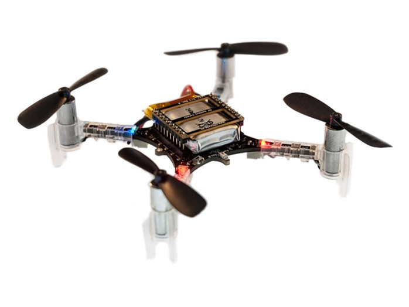
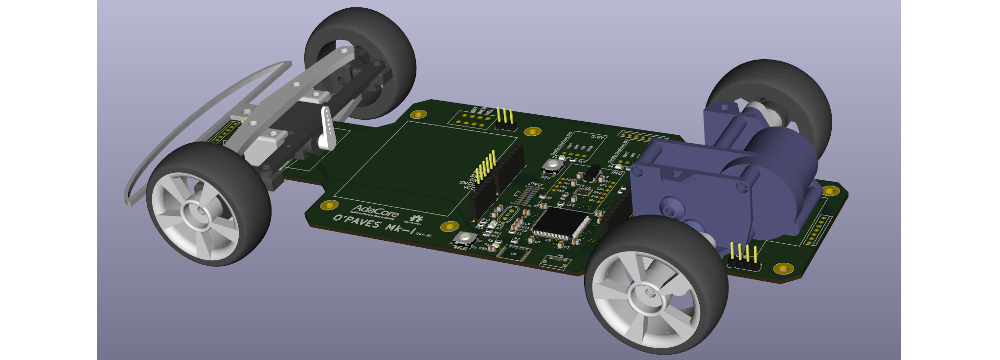

---
author:
- Fabien Chouteau
title: O'PAVES
subtitle: An open platform for autonomous vehicle tinkerers
titlepage-note: |
 Title notes...
institute: Embedded Software Engineer at AdaCore
twitter: DesChips
github: Fabien-Chouteau
hackaday: Fabien.C
fontsize: 15pt
theme: metropolis
...

## What is this project? ##

__Open Platform for Autonomous VEhicleS (O'PAVES)__

# Video demo! #

## Autonomous vehicle competitions 1/2 ##

\columnsbegin
\column{.53\textwidth}

\column{.47\textwidth}

\columnsend

## Autonomous vehicle competitions 2/2 ##

\columnsbegin
\column{.55\textwidth}

\column{.45\textwidth}

\columnsend

## Advanced Driver Assistance System

## For whom? ##

 * O'PAVES as a prototyping platform:
    * Students
    * Researchers
    * Hobbyists/Hackers/Makers
 * OPAVES as an AdaCore tool demonstrator:
    * Customers and prospects
    * Trade shows visitor

# Hardware #

## Hardware Requirements ##

 * Capable of addressing the classical autonomous vehicle challenges
    * Lane following
    * Collision avoidance
    * Autonomous parking
 * Affordable
 * Easy to buy and/or build

## Components ##

## PCB Frame ##

## 3D Printed Parts ##

## First Prototype ##

## First prototype vs requirements ##

 * Capable of addressing the challenges - YES
 * Affordable - YES
 * Easy to buy and/or build - Not really...

## New Version ##

\columnsbegin
\column{.45\textwidth}

\column{.1\textwidth}

\column{.4\textwidth}

\columnsend

## Open-Source Hardware ##

 * Released under the CERN Open Hardware License
 * Designed with open-source software:
    * KiCad
    * FreeCAD
 * Public repo: https://github.com/AdaCore/OPAVES

# Software #

## Software Architecture ##

## Auto-pilot interface ##

## Tools and libraries ##

 - Ada and SPARK: programming languages
 - Ada_Drivers_Library: Drivers for micro-controllers
 - Certyflie: Flight controller written in Ada and SPARK
 - GNATprove: Formal proof of the the SPARK code
 - GNATcoverage: Source coverage analysis (up to MCDC)

## Costs ##

|                 |              | 
|:----------------|-------------:| 
| PCB (by 10)     |         ~$50 | 
| Misc Components |        ~$110 | 
| Crazyflie 2.0   |         $180 | 
| __Total__       |        ~$380^[That's less than a Tesla] |

## Fork it, Build it, Use it, Improve it ##

Build it and make your own autonomous car!

Potential improvements:

 - Hardware 
    - Encoders on the motors
    - Change the PCB to make it compatible with your favorite dev board
 - Software 
    - Active differential
    - Actually use the sensors available

##

Follow the project on:

 * GitHub: [github.com/AdaCore/OPAVES](https://github.com/AdaCore/OPAVES)
 * Hackaday: [hackaday.io/project/17555-opaves](https://hackaday.io/project/17555-opaves)
 * Twitter: @[OpenPAVES](https://twitter.com/openpaves)
