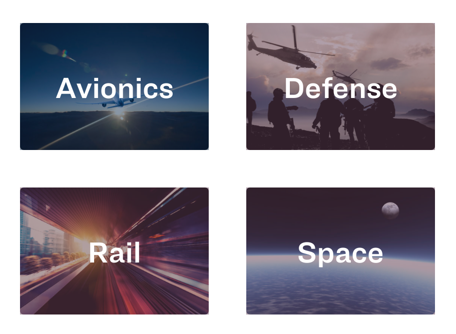
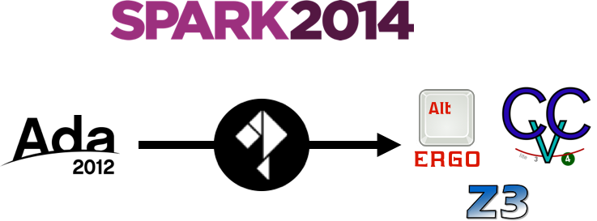
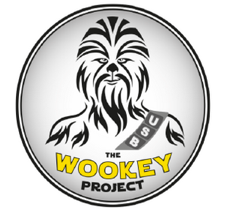
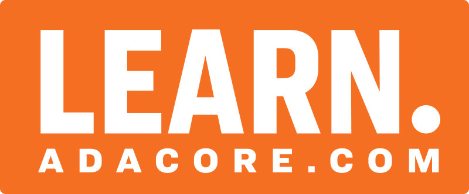

---
author:
- Fabien Chouteau
title: "SPARK: You simply can't write better code"
titlepage-note: |
 Title notes...
institute: Embedded Software Engineer at AdaCore
twitter: DesChips
github: Fabien-Chouteau
hackaday: Fabien.C
fontsize: 15pt
theme: metropolis
...

# When failure is not an option #

## Failure is not an option ##



# Functional Safety #

## Functional Safety ##

 - Testing
 - Code review
 - Trust me I know what I'm doing

## Programming is all about communication ##

With:

 - The compiler
 - The other tools (static analyzers, provers, etc.)
 - Users of your API
 - Your team
 - Yourself in a couple weeks...

## Contracts ##

```{.ada}
type Stack is tagged private;

function Empty (S : Stack) return Boolean;
function Full (S : Stack) return Boolean;

procedure Push (S : in out Stack; Val : Integer)
  with Pre  => not S.Full,
       Post => not S.Empty;

procedure Pop (S : in out Stack; Val : out Integer)
  with Pre  => not S.Empty,
       Post => not S.Full;

```

## Proving your code ##



## iFACTS - Air Traffic Management System ##

\columnsbegin
\column{.40\textwidth}


\column{.60\textwidth}

IFACTS, introduced in 2011, predicts an aircraft's location up to 18 minutes
into the future. NATS said the system has helped cut emissions and resulted in
a 40% capacity increase for some airspace sectors.

\columnsend

## EwoK - secure microkernel for USB ##

\columnsbegin
\column{.40\textwidth}



\column{.60\textwidth}

"Software classes of attacks (e.g. buffer overflows) are mitigated using EwoK
[...] providing more confidence by using the Ada safe language along with SPARK
for formal verification of critical parts."
[github.com/wookey-project/ewok-kernel](https://github.com/wookey-project/ewok-kernel)

\columnsend

## Getting started ##


