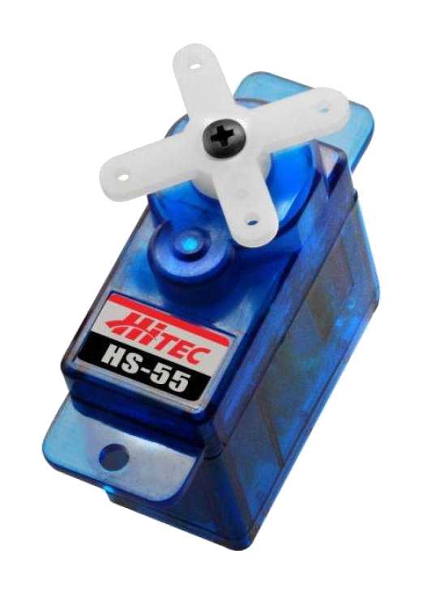
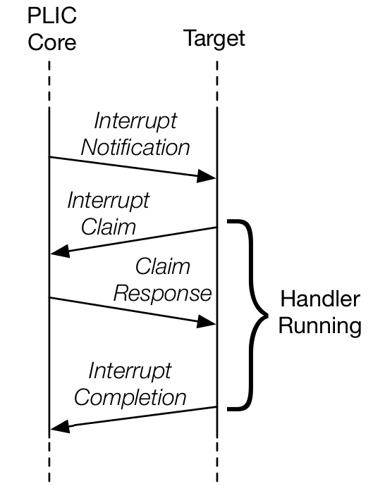
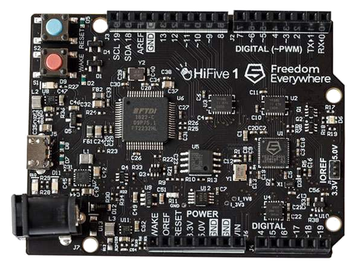
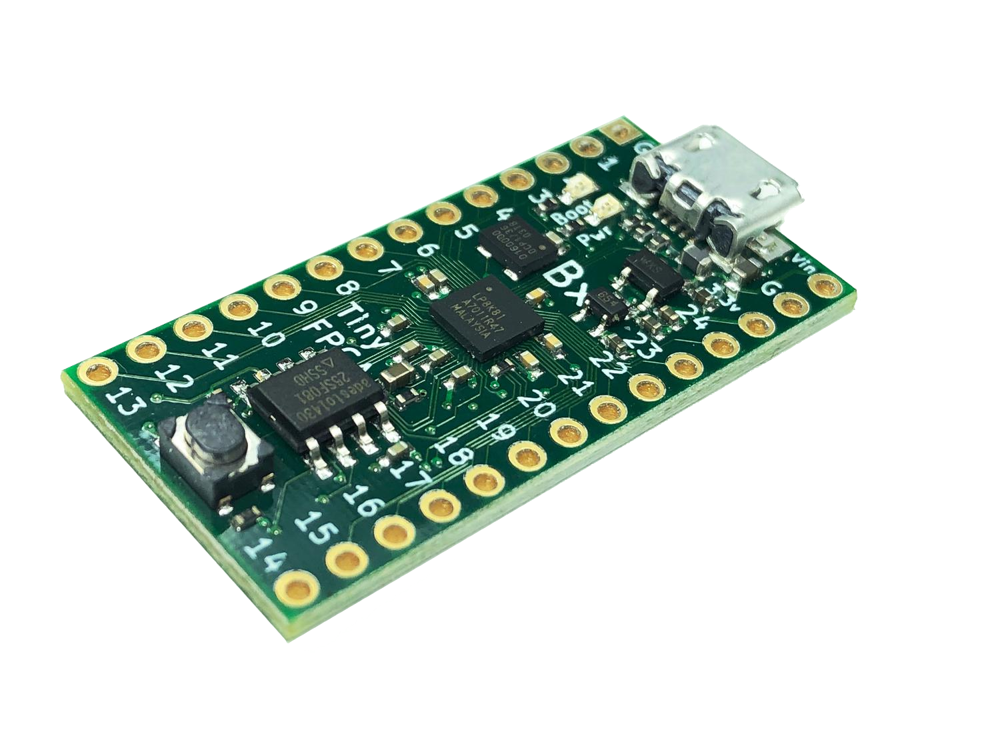
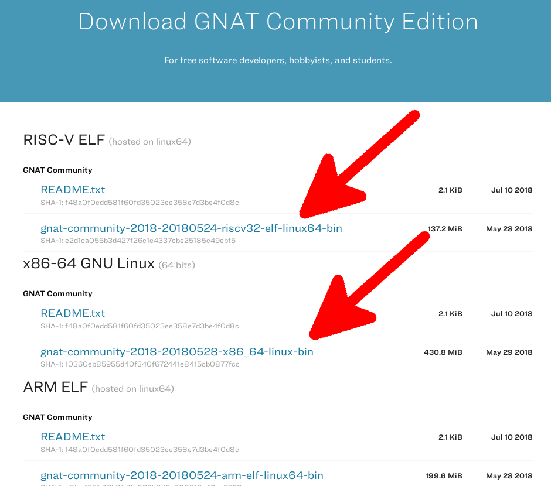

---
author:
- Fabien Chouteau
title: Alternative languages for safe and secure RISC-V programming
titlepage-note: |
 Title notes...
institute: Embedded Software Engineer at AdaCore
twitter: DesChips
github: Fabien-Chouteau
hackaday: Fabien.C
fontsize: 15pt
theme: metropolis
logo: images/adacore.png
...

# What do I mean by "alternative"? #

## What do I mean by "alternative"? ##


## ##


## ##


## ##


## Ada and SPARK ##

 - Designed for Safety and Security
 - Powerful means of specification 
 - Strong type checking
 - Object Oriented Programming
 - Concurrent programming features
 - Generic templates
 - Encapsulation
 - Hierarchical program composition / programming-in-the-large

## Programming is all about communication ##

With:

 - The compiler
 - The other tools (static analyzers, provers, etc.)
 - Users of your API
 - Your team
 - Yourself in a couple weeks...

## Example ##



## Specifications ##

```{.ada}
type Servo_Angle is new Float range -90.0 .. 90.0
--  Servo rotation angle in degree

procedure Set_Angle (Angle : Servo_Angle);
--  Set desired angle for the servo motor

```


## Contracts ##

```{.ada}
type Stack is tagged private;

function Empty (S : Stack) return Boolean;
function Full (S : Stack) return Boolean;

procedure Push (S : in out Stack; Val : Integer)
  with  Pre => not S.Full,
       Post => not S.Empty;

procedure Pop (S : in out Stack; Val : out Integer)
  with  Pre => not S.Empty,
       Post => not S.Full;

```

## Example: Writing an API for the RISC-V PLIC ##




## Example: Writing an API for the RISC-V PLIC ##

```{.ads}

Max_Interrupt : constant := 15;

type Any_Interrupt_ID is
  range 0 .. Max_Interrupt + 1;

No_Interrupt : constant Any_Interrupt_ID := Any_Interrupt_ID'Last;
--  Special value indicating no interrupt

subtype Interrupt_ID is
  Any_Interrupt_ID range 0 .. Max_Interrupt;

```

## Example: Writing an API for the RISC-V PLIC ##

```{.ads}
function Claimed return Any_Interrupt_ID

  with Ghost;

--  Return the last claimed interrupt
```

## Example: Writing an API for the RISC-V PLIC ##

```{.ads}
function Claim return Any_Interrupt_ID

  with  Pre => Claimed = No_Interrupt,

       Post => Claimed = Claim'Result;

--  Claim an interrupt on the PLIC for the current hart and
--  return its ID. Return No_Interrupt if there was no pending
--  interrupts for the hart when the claim was serviced.

```

## Example: Writing an API for the RISC-V PLIC ##

```{.ads}
procedure Complete (Interrupt : Interrupt_ID)

   with Pre  => Claimed /= No_Interrupt
                 and then
                Interrupt = Claimed,

        Post => Claimed = No_Interrupt;

--  Signal an interrupt completion for the current hart
```

## Checks ##

 - At run-time
    - Checks inserted in the code
    - For debug or testing
 - At Compile time
    - Compiler
    - Static analyzer
    - Formal verification (SPARK)

# Functional Safety #

## Hardware mapping ##

```{.ada}
--  High level view of the type
type Servo_Angle is new Float range -90.0 .. 90.0

--  Hardware representation of the type
  with Size      => 32,
       Alignment => 16;
```

## Hardware mapping ##

``` {.ada}
--  High level view of the Sense field
type Pin_Sense is
  (Disabled,
   High,
   Low)
  with Size => 2;

--  Hardware representation of the Sense field
for Pin_Sense use
  (Disabled => 0,
   High     => 2,
   Low      => 3);
```

## Hardware mapping ##

``` {.ada}
--  High level view of the register
type IO_Register is record
   Reserved_A : UInt4;
   SENSE      : Pin_Sense;
   Reserved_B : UInt2;
end record with Size => 32;

--  Hardware representation of the register
for IO_Register use record
   Reserved_A at 0 range 0 .. 3;
   SENSE      at 0 range 4 .. 5;
   Reserved_B at 0 range 6 .. 7;
end record;
```

## Hardware mapping ##

``` {.c}
#define SENSE_MASK     (0x30)
#define SENSE_POS      (4)

#define SENSE_DISABLED (0)
#define SENSE_HIGH     (2)
#define SENSE_LOW      (3)

uint8_t *register = 0x80000100;

// Clear Sense field
*register &= ~SENSE_MASK;
// Set sense value
*register |= SENSE_DISABLED << SENSE_POS;
```

## Hardware mapping ##

``` {.ada}
Register : IO_Register
  with Address => 16#8000_0100#;
```

``` {.ada}
Register.SENSE := Disabled;
```

## SVD -> Ada ##


``` {.xml}
<field>
  <name>SENSE</name>
  <description>Pin sensing mechanism.</description>
  <lsb>16</lsb> <msb>17</msb>
  <enumeratedValues>
    <enumeratedValue>
      <name>Disabled</name>
      <description>Disabled.</description>
      <value>0x00</value>
    </enumeratedValue>
 [...]
```
[github.com/AdaCore/svd2ada](https://github.com/AdaCore/svd2ada)

## Interfacing with C / Assembly ##

``` {.ada}
with Interfaces.C; use Interfaces.C;

[...]

function My_C_Function (A : int) return int
  with Pre => A /= 0;

pragma Import (C, My_C_Function, "my_c_function");


function My_Ada_Function (A : int) return int;

pragma Export (C, My_Ada_Function, "my_ada_function");

```

## Where Ada/SPARK is used? ##


## Emerging domains ##


## AdaCore ##

  - Software development eco-system:
     - GNAT: Ada compiler part of GCC 
     - IDEs
     - Code Coverage
     - Static analysis
     - Formal verification
     - Simulink code generator
  - Open-source
  - Ada, SPARK, C, C++
  - Dozens of platforms (including RISC-V :)
  - Front line support
  - DO-178, EN 50128, ISO 26262


## AdaCore joins the RISC-V foundation ##

\columnsbegin
\column{.53\textwidth}


\column{.47\textwidth}


\columnsend

# Getting started #

## Hardware ##

\columnsbegin
\column{.53\textwidth}



\column{.47\textwidth}



\columnsend

## Download and install the tools: adacore.com/community ##



## Download Ada Drivers Library ##


## ##

\includemovie[autoplay,repeat]{300pt}{200pt}{images/RISC-V_EW_demo_x20.mp4}

# Keep the door open #

## What as already been done ##

 - Open specs and documentation

 - RISC-V support in open-source tools:

    - Compilers (GCC, LLVM)

    - Debuggers (Gdb, openocd)

    - Simulators (QEMU)

## Challenges ##

 - Complexity of extension combinations

    RV(32|64|128) I M A C B [F|D|Q] ...

 - Deviation from the standard

 - Custom/proprietary extensions

 - Reference implementations in C

## Hardware description ##

Do we need to go beyond SVD?

 - Registers \checkmark
 - Interrupts \checkmark
 - CPU specs ?
 - RAM and ROM banks ?
 - Modular representation ?
 - Tools that generate SVD from custom design ?

## Resources ##

 - learn.adacore.com : interactive learning website
 - Twitter : @AdaProgrammers
 - Reddit  : r/ada
