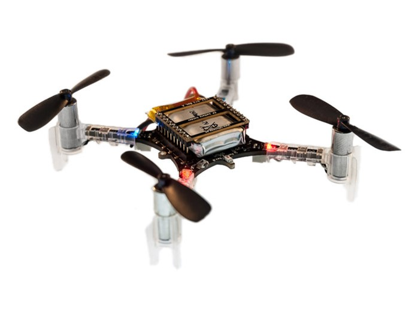
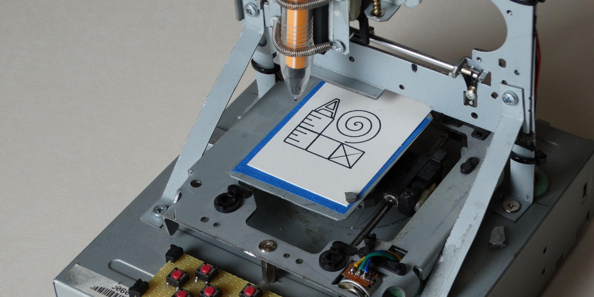
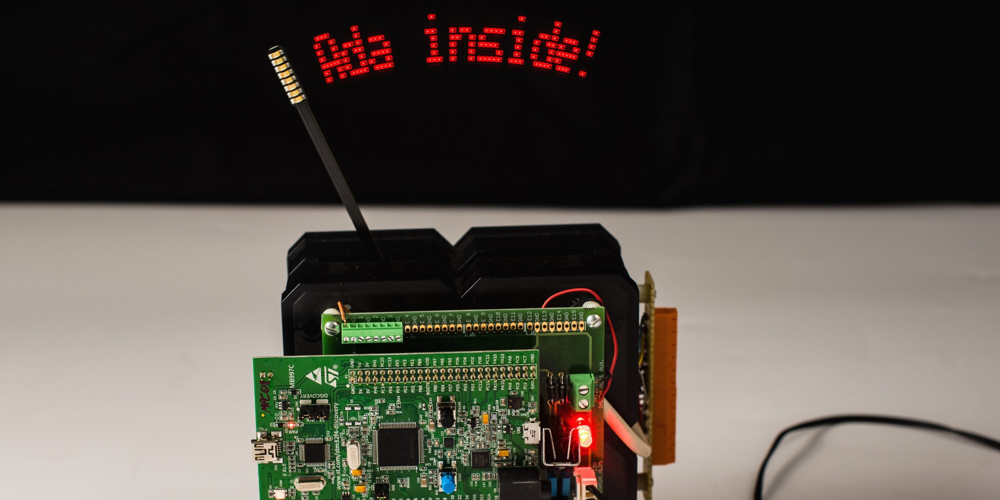
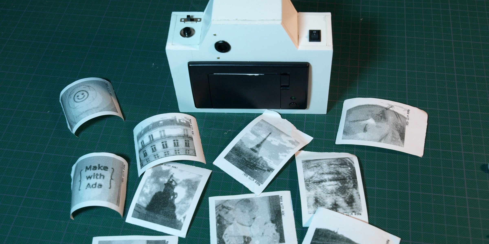
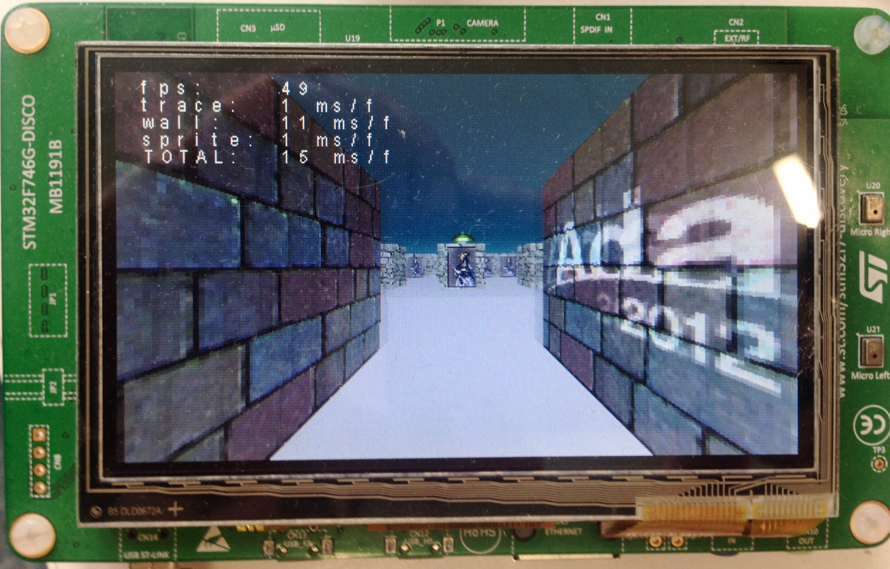
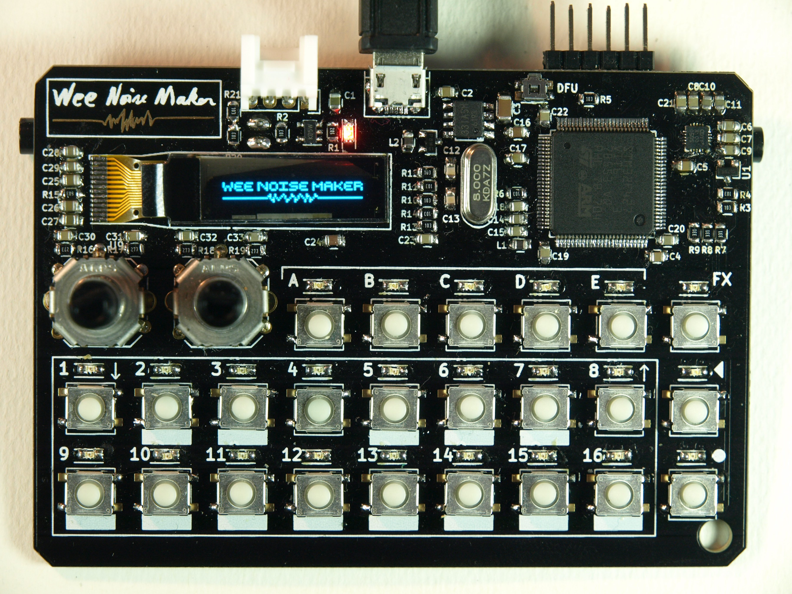

---
author:
- Fabien Chouteau
title: Embedded Programming with Ada
titlepage-note: |
 Title notes...
institute: Embedded Software Engineer at AdaCore
twitter: DesChips
github: Fabien-Chouteau
hackaday: Fabien.C
fontsize: 15pt
theme: metropolis
...

# Ravenscar Tasking #

## Ravenscar Tasking ##

A.K.A There's a mini-RTOS in my languge^[blog.adacore.com/theres-a-mini-rtos-in-my-language]

 - Tasks (threads)
 - Time handling
    - Clock
    - Delays
 - Protected Objects:
    - Mutual exclusion
    - Synchronization between tasks
    - Interrupt handling

## Tasks ##

``` {.ada}
--  Task type declaration
task type My_Task (Prio : System.Priority)
  with Priority => Prio;
```

``` {.ada}
T1 : My_Task (Prio => 1);
T2 : My_Task (Prio => 2);
```

## Time ##

``` {.ada}
task body My_Task is
   Period       : constant Time_Span := Milliseconds (100);

   Next_Release : Time := Clock + Period;
   --  Set Initial release time
begin
   loop
      --  Suspend My_Task until the Clock is greater
      --  than Next_Release.
      delay until Next_Release;
      --  Compute the next release time
      Next_Release := Next_Release + Period;

      --  Do something really cool at 10Hz...
   end loop;
end My_Task;
```

## Mutual exclusion and shared resources ##

``` {.ada}
protected My_Protected_Object
  with Priority => 3
is

   procedure Set_Data (Data : Integer);
   --  Protected procedues can read and/or modifiy the
   --  protected data.

   function Data return Integer;
   --  Protected functions can only read the protected data

private
   --  Protected data are declared in the private part
   PO_Data : Integer := 0;
end;
```

## Synchronization 1/2 ##

``` {.ada}
protected My_Protected_Object is
   entry Wait_For_Signal;
   procedure Send_Signal;
private
   We_Have_A_Signal : Boolean := False;
end My_Protected_Object;
```

## Synchronization 2/2 ##

``` {.ada}
protected body My_Protected_Object is

   entry Wait_For_Signal when We_Have_A_Signal is
   begin
       We_Have_A_Signal := False;
   end Wait_For_Signal;

   procedure Send_Signal is
   begin
       We_Have_A_Signal := True;
   end Send_Signal;

end My_Protected_Object;
```

## Interrupt handling 1/2 ##

``` {.ada}
protected My_Protected_Object
  with Interrupt_Priority => 255
is
   entry Get_Next_Character (C : out Character);

private
   procedure UART_Interrupt_Handler
           with Attach_Handler => UART_Interrupt;

   Received_Character  : Character := ASCII.NUL;
   We_Have_A_Character : Boolean := False;
end;
```

## Interrupt handling 2/2 ##

``` {.ada}
protected body My_Protected_Object is

   entry Get_Next_Character (C : out Character)
     when We_Have_A_Character
   is
   begin
       C := Received_Character;
       We_Have_A_Char := False;
   end Get_Next_Character;

   procedure UART_Interrupt_Handler is
   begin
       Received_Character  := A_Character_From_UART_Device;
       We_Have_A_Character := True;
   end UART_Interrupt_Handler;
end;
```

## Runtimes profiles ##


<!--
## Runtimes profiles ##

   - Zero FootPrint (ZFP)
     - The bare minimum to program in Ada
     - Static/compile time features of Ada
     - Tagged types (Object Oriented)
     - Contracts, run-time checks
   - Ravenscar Small FootPrint (SFP)
     - ZFP + Ravenscar tasking
   - Ravenscar Full
     - Ravenscar SFP + everything we can add
     - Exception propagation
     - Containers

-->

# Hardware mapping #

## Hardware mapping ##

```{.ada}
--  High level view of the type
type Servo_Angle is range -90 .. 90

--  Hardware representation of the type
  with Size      => 8,
       Alignment => 16;
```

## Memory mapped registers ##


## Hardware mapping ##


## Hardware mapping ##

``` {.c}
#define SENSE_MASK     (0x30)
#define SENSE_POS      (4)

#define SENSE_DISABLED (0)
#define SENSE_HIGH     (2)
#define SENSE_LOW      (3)

uint8_t *register = 0x80000100;

// Clear Sense field
*register &= ~SENSE_MASK;
// Set sense value
*register |= SENSE_DISABLED << SENSE_POS;
```

## Hardware mapping ##

``` {.ada}
--  High level view of the Sense field
type Pin_Sense is
  (Disabled,
   High,
   Low)
  with Size => 2;

--  Hardware representation of the Sense field
for Pin_Sense use
  (Disabled => 0,
   High     => 2,
   Low      => 3);
```

## Hardware mapping ##

``` {.ada}
--  High level view of the register
type IO_Register is record
   Reserved_A : UInt4;
   SENSE      : Pin_Sense;
   Reserved_B : UInt2;
end record;

--  Hardware representation of the register
for IO_Register use record
   Reserved_A at 0 range 0 .. 3;
   SENSE      at 0 range 4 .. 5;
   Reserved_B at 0 range 6 .. 7;
end record;
```

## Hardware mapping ##

``` {.ada}
Register : IO_Register
  with Address => 16#8000_0100#;
```

``` {.ada}
Register.SENSE := Disabled;
```

## SVD -> Ada ##


``` {.xml}
<field>
  <name>SENSE</name>
  <description>Pin sensing mechanism.</description>
  <lsb>16</lsb> <msb>17</msb>
  <enumeratedValues>
    <enumeratedValue>
      <name>Disabled</name>
      <description>Disabled.</description>
      <value>0x00</value>
    </enumeratedValue>
 [...]
```
[github.com/AdaCore/svd2ada](https://github.com/AdaCore/svd2ada)

# Interfacing with C / Assembly #

## Interfacing with C / Assembly ##

``` {.ada}
with Interfaces.C; use Interfaces.C;

[...]

function My_C_Function (A : int) return int;
pragma Import (C, My_C_Function, "my_c_function");

function My_Ada_Function (A : int) return int;
pragma Export (C, My_Ada_Function, "my_ada_function");

```

## Interfacing with C / Assembly ##

``` {.c}

int my_ada_function(int a);

void adainit(void);

void adafinal(void);


void main(void) {
  adainit();

  my_ada_function(42);

  adafinal();
}

```

# The Ada Drivers Library #

## Ada Drivers Library ##

 - Firmware library
 - Hardware and vendor independent
 - 100% Ada
 - Hosted on GitHub: [github.com/AdaCore/Ada_Drivers_Library](github.com/AdaCore/Ada_Drivers_Library)

<!--
## Components ##


## Supported components ##

 - Audio DAC: SGTL5000, CS43L22, W8994
 - Camera: OV2640, OV7725
 - IO expander: MCP23XXX, STMPE1600, HT16K33
 - Motion: AK8963, BNO055, L3GD20, LIS3DSH, MMA8653, MPU9250
 - Range: VL53L0X
 - LCD: ILI9341, OTM8009a, ST7735R, SSD1306
 - Touch panel: FT5336, FT6X06, STMPE811
 - Module:
    - AdaFruit's trellis
    - AdaFruit's Thermal printer

## Middleware ##

 - Bitmap drawing
 - File System: FAT and ARM semi-hosting
 - Log utility

-->

## Architecture ##


## Supported platforms ##

\columnsbegin
\column{.53\textwidth}


\column{.47\textwidth}


\columnsend

# Getting started demo #

## Download and install the tools: adacore.com/community ##


## Download Ada Drivers Library ##


## The Make with Ada Competition ##

 - Embedded software project competition
 - Open to everyone
 - ~8000 euros in prize
 - [makewithada.org](makewithada.org (Twitter @adaprogrammers)


## 2016 Winner project (Stephane Carrez) ##

[github.com/stcarrez/etherscope](https://github.com/stcarrez/etherscope)


## 2017 Winner project (Jonas Attertun) ##

[blog.adacore.com/make-with-ada-2017-brushless-dc-motor-controller](http://blog.adacore.com/make-with-ada-2017-brushless-dc-motor-controller)


# Some projects base on the Ada Drivers Library #

## Crazyflie 2.0 Flight controller ##

[blog.adacore.com/how-to-prevent-drone-crashes-using-spark](http://blog.adacore.com/how-to-prevent-drone-crashes-using-spark)


## CNC Controller ##

[blog.adacore.com/make-with-ada-arm-cortex-m-cnc-controller](http://blog.adacore.com/make-with-ada-arm-cortex-m-cnc-controller)


## Pendulum clock LED ##

[blog.adacore.com/writing-on-air](http://blog.adacore.com/writing-on-air)


## DIY instant camera ##

[blog.adacore.com/make-with-ada-diy-instant-camera](http://blog.adacore.com/make-with-ada-diy-instant-camera)


## Wolf ##

[github.com/lambourg/Ada_Bare_Metal_Demos](https://github.com/lambourg/Ada_Bare_Metal_Demos)


## Wee Noise Maker ##

[github.com/Fabien-Chouteau/Wee-Noise-Maker](https://github.com/Fabien-Chouteau/Wee-Noise-Maker)

