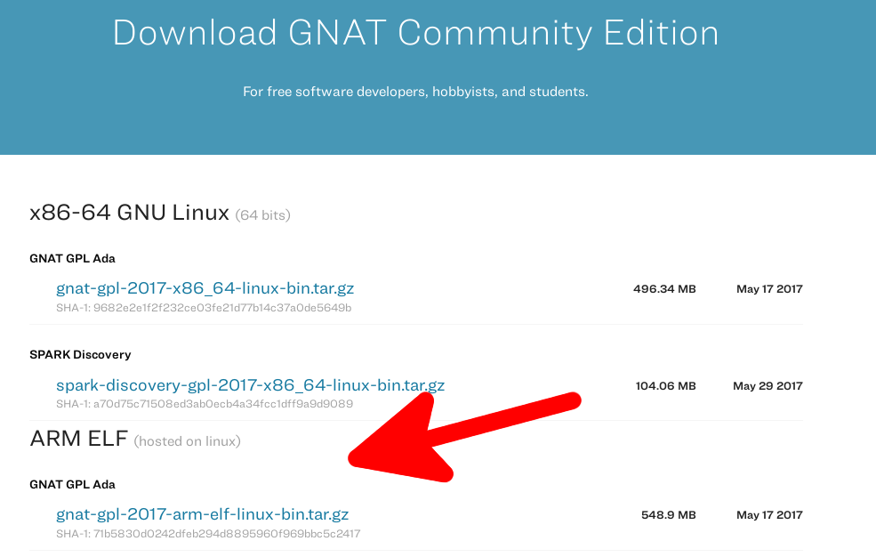
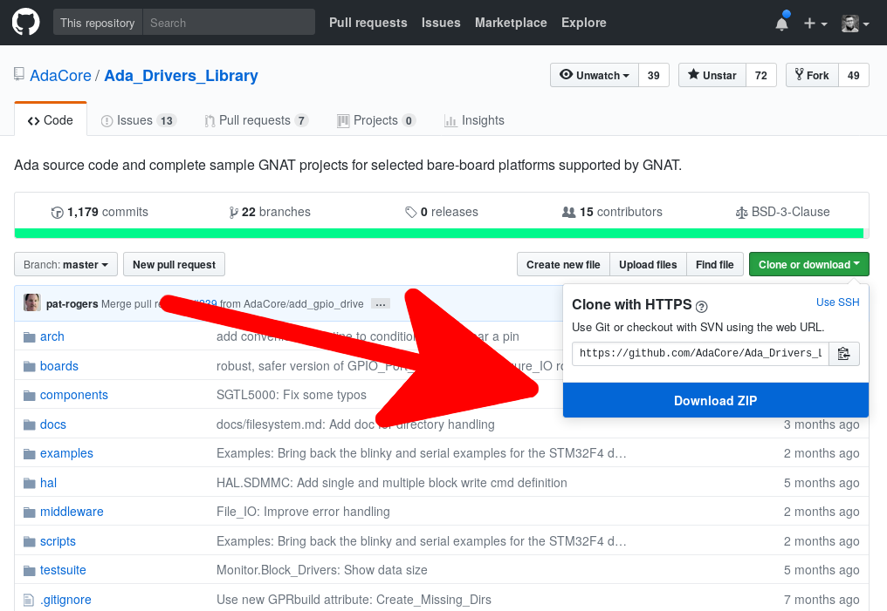
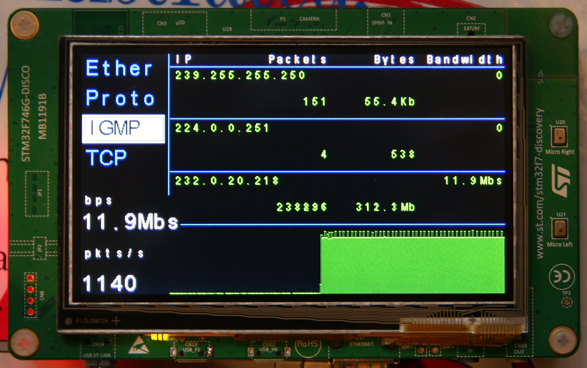
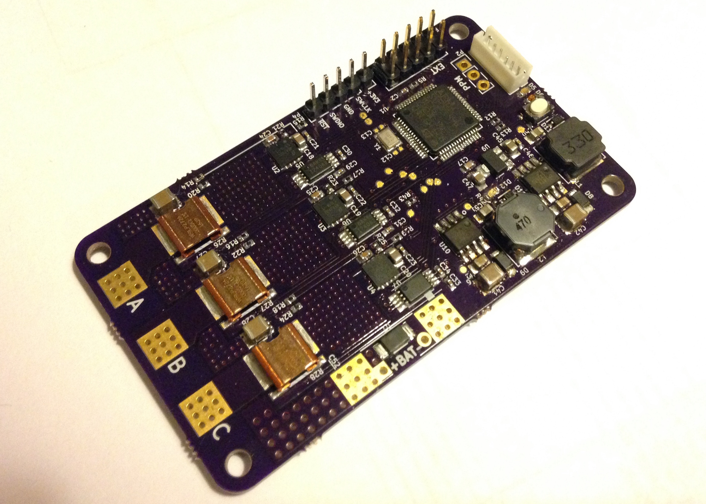

---
author:
- Fabien Chouteau
title: Embedded Programming with Ada
titlepage-note: |
 Title notes...
institute: Embedded Software Engineer at AdaCore
twitter: DesChips
github: Fabien-Chouteau
hackaday: Fabien.C
fontsize: 15pt
theme: metropolis
logo: images/adacore.png
...

## Ada and SPARK ##

 - Designed for Safety and Security
 - Powerful means of specification 
 - Strong type checking
 - Object Oriented Programming
 - Concurrent programming features, including support for multicore
 - Generic templates
 - Encapsulation
 - Hierarchical program composition / programming-in-the-large

## Specifications ##

```{.ada}
type Power is range 0 .. 100;

procedure Set_Motor_Power (P : Power);
--  Set desired power for the motor
```

## Resources and Performances ##

 Comparable to C/C++ for the same level of features:

 - Do you need exceptions?
 - Do you need Object Oriented Programming?
 - Do you need an RTOS?
 - Do you need run-time checks?

## Supported Platforms ##

 - ARM Cortex-A
 - ARM Cortex-R
 - ARM Cortex-M
 - PowerPC 32 and 64
 - x86 and x86-64
 - SPARC
 - RISC-V
 - and more...

## Ravenscar Tasking ##

A.K.A There's a mini-RTOS in my language^[blog.adacore.com/theres-a-mini-rtos-in-my-language]

 - Tasks (threads)
 - Time handling
    - Clock
    - Delays
 - Protected Objects:
    - Mutual exclusion
    - Synchronization between tasks
    - Interrupt handling

## Hardware mapping ##

```{.ada}
--  High level view of the type
type Power is range 0 .. 100

--  Hardware representation of the type
  with Size      => 8,
       Alignment => 16;
```

## Interfacing with C / Assembly ##

``` {.ada}
with Interfaces.C; use Interfaces.C;

[...]

function My_C_Function (A : int) return int;
pragma Import (C, My_C_Function, "my_c_function");

function My_Ada_Function (A : int) return int;
pragma Export (C, My_Ada_Function, "my_ada_function");

```

# Getting started demo #

## Download and install the tools: adacore.com/community ##



## Download Ada Drivers Library ##



## The Make with Ada Competition ##

 - Embedded software project competition
 - Open to everyone
 - ~8000 euros in prize
 - [makewithada.org](makewithada.org) (Twitter @adaprogrammers)


## 2016 Winner project (Stephane Carrez) ##

[github.com/stcarrez/etherscope](https://github.com/stcarrez/etherscope)


## 2017 Winner project (Jonas Attertun) ##

[blog.adacore.com/make-with-ada-2017-brushless-dc-motor-controller](http://blog.adacore.com/make-with-ada-2017-brushless-dc-motor-controller)

