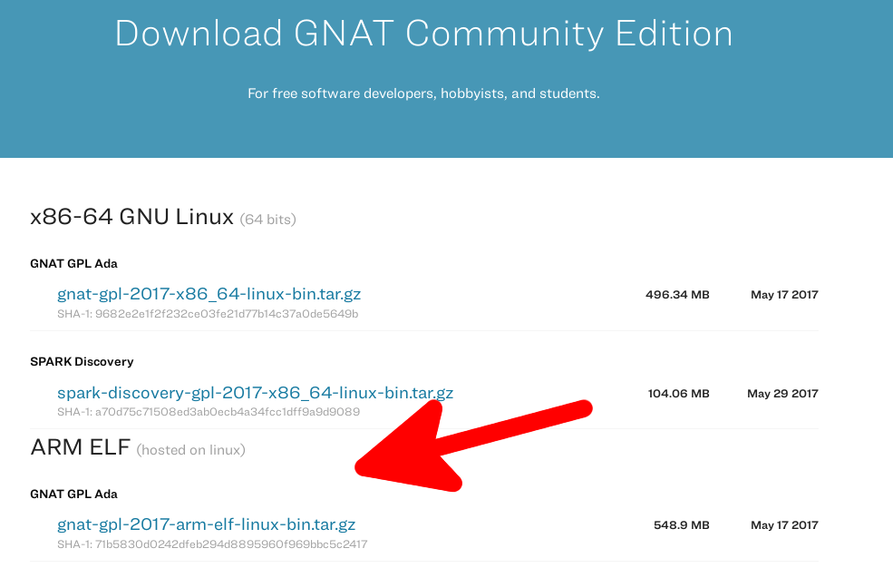
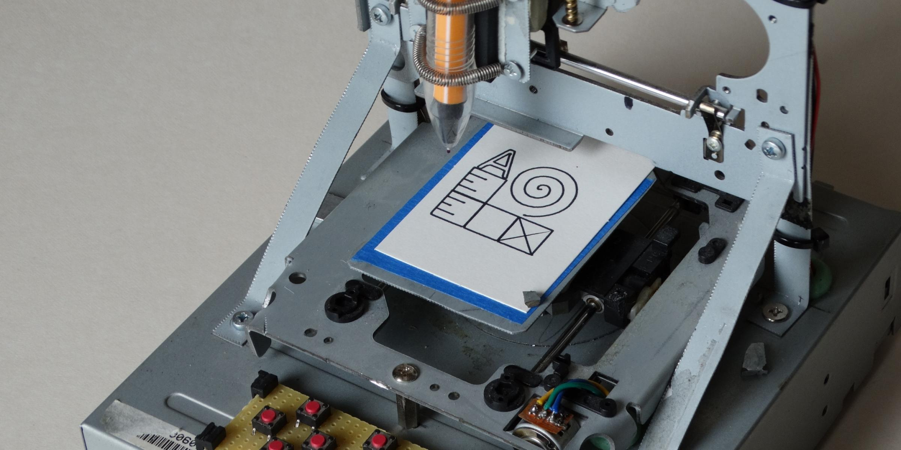
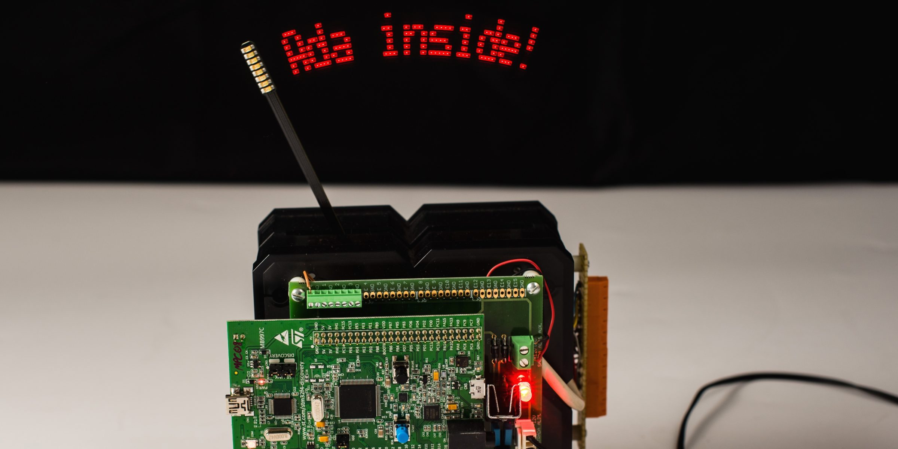
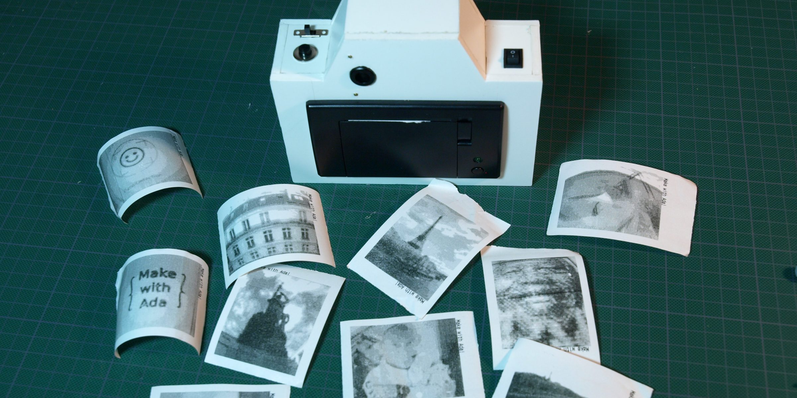
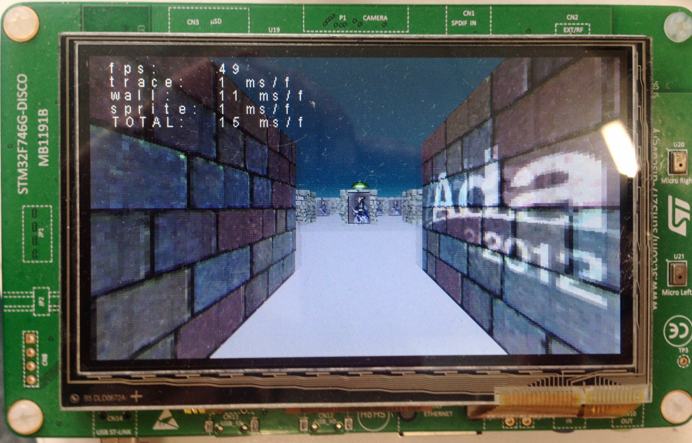
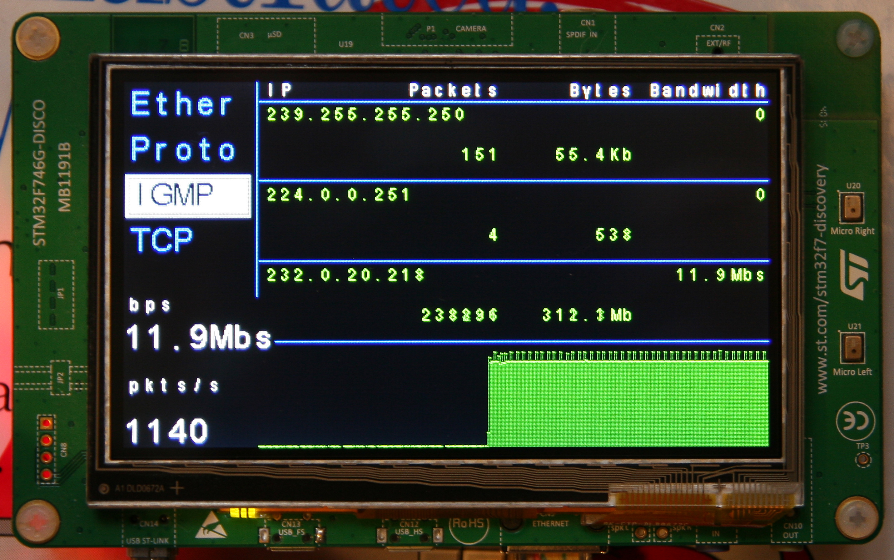
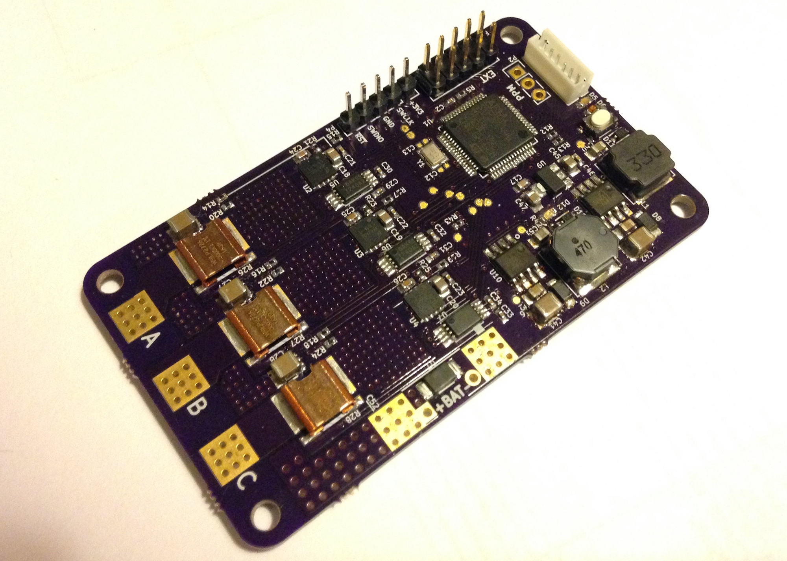

---
author:
- Fabien Chouteau
title: Making the Ada Drivers Library
subtitle: Embedded Programming with Ada
titlepage-note: |
 Title notes...
institute: Embedded Software Engineer at AdaCore
twitter: DesChips
github: Fabien-Chouteau
hackaday: Fabien.C
fontsize: 15pt
theme: metropolis
...

# Programming is all about communication #

## Programming is all about communication ##

With:

>- The compiler
>- The other tools (static analyzers, provers, etc.)
>- Users of your API
>- Your colleagues
>- The idiot that wrote this stupid piece of code...
>- __Oh, wait. It was me two months ago :(__

## What makes Embedded Programming different? ##

Every bug costs more:

 - More time to investigate
 - More time to try a fix
 - Potential destruction of hardware
 - Updates are difficult

You need more control:

 - Low resources (RAM, flash, CPU)
 - Interaction with the hardware
 - Real-Time constraints

# Embedded Programming with Ada #

## Servo motor example ##
\columnsbegin
\column{.20\textwidth}


\column{.80\textwidth}


\columnsend

## Servo motor example ##

\columnsbegin
\column{.20\textwidth}


\column{.80\textwidth}


\columnsend

## Servo motor example ##
\columnsbegin
\column{.20\textwidth}


\column{.80\textwidth}


\columnsend

## Types ##

```{.ada}
procedure Set_Angle (Angle : Integer);
```

## Types ##

```{.ada}
--  Set desired angle for the servo motor
--
--  @param Angle: Desired rotation angle in degree.
--  Please do not use a value above 90 or below -90!
procedure Set_Angle (Angle : Integer);
```

## Types ##

```{.ada}
type Servo_Angle is range -90 .. 90;
--  Servo rotation angle in degree

procedure Set_Angle (Angle : Servo_Angle);
--  Set desired angle for the servo motor

```

## The compiler: GNAT ##

```{.ada}
Set_Angle (100);
```

```
warning: value not in range of type "Servo_Angle"
warning: "Constraint_Error" will be raised at run time
```

## The static analyzer: CodePeer ##

```{.ada}
procedure Set_Angle_Double (X : Servo_Angle) is
begin
   Set_Angle (X * 2);
end Set_Angle_Double;

Set_Angle_Double (80);

```
servo_driver.adb:27:4: high: precondition (range check) failure on call to servo_driver.set_angle_double: requires X in -45..45```
```

## The formal proof: SPARK ##

```
Phase 1 of 2: generation of Global contracts ...
servo_driver.adb:42:04: error in inlined body at line 23
servo_driver.adb:42:04: value not in range of type
   "Servo_Angle" defined at line 7
servo_driver.adb:42:04: "Constraint_Error" would have
   been raised at run time
```

## The debugger: Gdb ##

```
(gdb) catch exception
Catchpoint 1: all Ada exceptions
(gdb) run

Catchpoint 1, CONSTRAINT_ERROR
   (servo_driver.adb:23 overflow check failed)
```

## The code: Exception handling ##

``` {.ada}
procedure Set_Angle_Catch (X : Servo_Angle) is
begin

   Set_Angle (X * 2);

exception

   when Constraint_Error =>
      Put_Line ("Well, that was close");

end Set_Angle_Catch;
```

## Your last chance ##

``` {.ada}

procedure Last_Chance_Handler is
begin

   --  Oops, there's something wrong

   Reset_The_Board;

end Last_Chance_Handler;
```

## YOLO ##

^[cyanide and happiness]

<!---
## Types ##

```{.ada}
subtype Safe_Range is Servo_Angle range -45 .. 10;

if Angle in Safe_Range then
   [...]
end if;

```
-->

## Contracts ##

```{.ada}
procedure Set_Angle (Angle : Servo_Angle)
   with Pre => Initialized;
--  Set desired angle for the servo motor

function Initialized return Boolean;
--  Return True if the driver is initialized

procedure Initialize
   with Post => Initialized;
--  Initialize the servo motor driver

```

## Null access ##

```{.ada}
procedure Plop (Ptr : not null Some_Pointer);
```

## Hardware mapping ##

```{.ada}
--  High level view of the type
type Servo_Angle is range -90 .. 90

--  Hardware representation of the type
  with Size      => 8,
       Alignment => 16;
```

## Memory mapped registers ##


## Hardware mapping ##


## Hardware mapping ##

``` {.c}
#define SENSE_MASK     (0x30)
#define SENSE_POS      (4)

#define SENSE_DISABLED (0)
#define SENSE_HIGH     (2)
#define SENSE_LOW      (3)

uint8_t *register = 0x80000100;

// Clear Sense field
*register &= ~SENSE_MASK;
// Set sense value
*register |= SENSE_DISABLED << SENSE_POS;
```

## Hardware mapping ##

``` {.ada}
--  High level view of the Sense field
type Pin_Sense is
  (Disabled,
   High,
   Low)
  with Size => 2;

--  Hardware representation of the Sense field
for Pin_Sense use
  (Disabled => 0,
   High     => 2,
   Low      => 3);
```

## Hardware mapping ##

``` {.ada}
--  High level view of the register
type IO_Register is record
   Reserved_A : UInt4;
   SENSE      : Pin_Sense;
   Reserved_B : UInt2;
end record;

--  Hardware representation of the register
for IO_Register use record
   Reserved_A at 0 range 0 .. 3;
   SENSE      at 0 range 4 .. 5;
   Reserved_B at 0 range 6 .. 7;
end record;
```

## Hardware mapping ##

``` {.ada}
Register : IO_Register
  with Address => 16#8000_0100#;
```

``` {.ada}
Register.SENSE := Disabled;
```

## SVD -> Ada ##


``` {.xml}
<field>
  <name>SENSE</name>
  <description>Pin sensing mechanism.</description>
  <lsb>16</lsb> <msb>17</msb>
  <enumeratedValues>
    <enumeratedValue>
      <name>Disabled</name>
      <description>Disabled.</description>
      <value>0x00</value>
    </enumeratedValue>
 [...]
```
[github.com/AdaCore/svd2ada](https://github.com/AdaCore/svd2ada)

## Ravenscar Tasking ##

A.K.A There's a mini-RTOS in my languge^[blog.adacore.com/theres-a-mini-rtos-in-my-language]

 - Tasks (threads)
 - Time handling
    - Clock
    - Delays
 - Protected Objects:
    - Mutual exclusion
    - Synchronization between tasks
    - Interrupt handling
 
## Taks ##

``` {.ada}
task body My_Task is
   Next_Release : Time;
begin
   --  Set Initial release time
   Next_Release := Clock + Milliseconds (100);

   loop
      --  Suspend My_Task
      delay until Next_Release;

      --  Compute the next release time
      Next_Release := Next_Release + Milliseconds (100);
      
      --  Do something really cool at 10Hz...
   end loop;
end My_Task;
```
<!---

## Synchronization 1/2 ##

``` {.ada}
protected My_Protected_Object is
   entry Wait_For_Signal;
   procedure Send_Signal;
private
   We_Have_A_Signal : Boolean := False;
end My_Protected_Object;
```

## Synchronization 2/2 ##

``` {.ada}
protected body My_Protected_Object is

   entry Wait_For_Signal when We_Have_A_Signal is
   begin
       We_Have_A_Signal := False;
   end Wait_For_Signal;

   procedure Send_Signal is
   begin
       We_Have_A_Signal := True;
   end Send_Signal;

end My_Protected_Object;
```

## Interrupt handling 1/2 ##

``` {.ada}
protected My_Protected_Object
  with Interrupt_Priority => 255
is
   entry Get_Next_Character (C : out Character);

private
   procedure UART_Interrupt_Handler
           with Attach_Handler => UART_Interrupt;

   Received_Character  : Character := ASCII.NUL;
   We_Have_A_Character : Boolean := False;
end;
```

## Interrupt handling 2/2 ##

``` {.ada}
protected body My_Protected_Object is

   entry Get_Next_Character (C : out Character)
     when We_Have_A_Character
   is
   begin
       C := Received_Character;
       We_Have_A_Char := False;
   end Get_Next_Character;

   procedure UART_Interrupt_Handler is
   begin
       Received_Character  := A_Character_From_UART_Device;
       We_Have_A_Character := True;
   end UART_Interrupt_Handler;
end;
```
-->

<!---
## Runtimes profiles ##


## Runtimes profiles ##

   - Zero FootPrint (ZFP)
     - The bare minimum to program in Ada
     - Static/compile time features of Ada
     - Tagged types (Object Oriented)
     - Contracts, run-time checks
   - Ravenscar Small FootPrint (SFP)
     - ZFP + Ravenscar tasking
   - Ravenscar Full
     - Ravenscar SFP + everything we can add
     - Exception propagation
     - Containers
}
-->

# Making the Ada Drivers Library #

## Ada Drivers Library ##

 - Firmware library
 - Hardware and vendor independent
 - 100% Ada
 - Hosted on GitHub: [github.com/AdaCore/Ada_Drivers_Library](github.com/AdaCore/Ada_Drivers_Library)

## Components ##


## Supported components ##

 - Audio DAC: SGTL5000, CS43L22, W8994
 - Camera: OV2640, OV7725
 - IO expander: MCP23XXX, STMPE1600, HT16K33
 - Motion: AK8963, BNO055, L3GD20, LIS3DSH, MMA8653, MPU9250
 - Range: VL53L0X
 - LCD: ILI9341, OTM8009a, ST7735R, SSD1306
 - Touch panel: FT5336, FT6X06, STMPE811
 - Module:
    - AdaFruit's trellis
    - AdaFruit's Thermal printer

## Middleware ##

 - Bitmap drawing
 - File System: FAT and ARM semi-hosting
 - Log utility

## Architecture ##


## Supported platforms ##

\columnsbegin
\column{.53\textwidth}


\column{.47\textwidth}


\columnsend

## STM32F405 Discovery (ARM Cortex-M4F) ##


## STM32F429 Discovery (ARM Cortex-M4F) ##


## STM32F469 Discovery  (ARM Cortex-M4F) ##


## STM32F746 Discovery  (ARM Cortex-M7F) ##


## STM32F769 Discovery  (ARM Cortex-M7F) ##


## OpenMV 2 (ARM Cortex-M4F) ##


## Crazyflie 2.0 (ARM Cortex-M4F) ##


## BBC Micro:Bit (ARM Cortex-M0) ##


## HiFive1 (RISC-V) ##


## What's next? ##

TODOs:

 - New configuration and build system
 - More documentation
 - Basic out of the box support of all the Cortex-M devices
 - Linux GPIO/I2C/SPI support (on the Raspberry Pi for instance)
 - AVR platform
 - More components drivers
 - USB stack and drivers on the STM32
 - Bluetooth Low Energy stack on the Micro:Bit

# Getting started demo #

## Download and install the tools: adacore.com/community ##



## Download Ada Drivers Library ##


# Some projects using the Ada Drivers Library #

## Crazyflie 2.0 Flight controller ##

[blog.adacore.com/how-to-prevent-drone-crashes-using-spark](http://blog.adacore.com/how-to-prevent-drone-crashes-using-spark)


## CNC Controller ##

[blog.adacore.com/make-with-ada-arm-cortex-m-cnc-controller](http://blog.adacore.com/make-with-ada-arm-cortex-m-cnc-controller)


## Pendulum clock LED ##

[blog.adacore.com/writing-on-air](http://blog.adacore.com/writing-on-air)


## DIY instant camera ##

[blog.adacore.com/make-with-ada-diy-instant-camera](http://blog.adacore.com/make-with-ada-diy-instant-camera)


## Wolf ##

[github.com/lambourg/Ada_Bare_Metal_Demos](https://github.com/lambourg/Ada_Bare_Metal_Demos)


## Wee Noise Maker ##

[github.com/Fabien-Chouteau/Wee-Noise-Maker](https://github.com/Fabien-Chouteau/Wee-Noise-Maker)


## The Make with Ada Competition ##

 - Embedded software project competition
 - Open to everyone
 - ~8000 euros in prize
 - Stay tuned for the next edition (Twitter @adaprogrammers)


## 2016 Winner project (Stephane Carrez) ##

[github.com/stcarrez/etherscope](https://github.com/stcarrez/etherscope)


## 2017 Winner project (Jonas Attertun) ##

[blog.adacore.com/make-with-ada-2017-brushless-dc-motor-controller](http://blog.adacore.com/make-with-ada-2017-brushless-dc-motor-controller)


# What are you going to make? #

## ##

 * GitHub: [github.com/AdaCore/Ada_Drivers_Library](https://github.com/AdaCore/Ada_Drivers_Library)
 * Twitter: @[AdaProgrammers](https://twitter.com/adaprogrammers)
